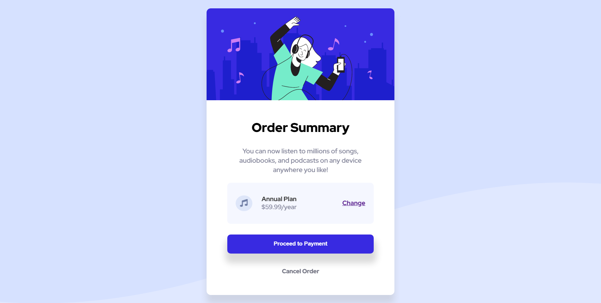

## Order Summary Component - Frontend Mentor
A perfect project for newbies who are starting to build confidence with layouts!

## Over View
#Frontend Mentor Level Rating:
Difficulty: Newbie
Languages: HTML & CSS

# Brief
Challenge is to build out this order summary card component and get it looking as close to the design as possible.

You can use any tools you like to help you complete the challenge. So if you've got something you'd like to practice, feel free to give it a go.

Your users should be able to:

See hover states for interactive elements

## Things Learned / Practicing:
# Practicing: 
- HTML
- CSS

### Screenshot

[Link to live project](https://order-summary-card33.netlify.app/)

